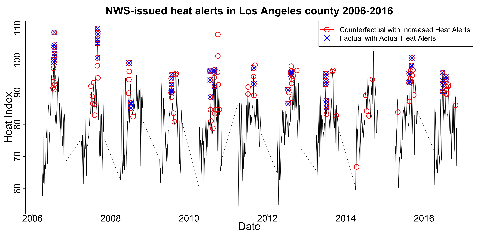

# Assessing the causal effects of a stochastic intervention in time series data: Are heat alerts effective in preventing deaths and hospitalizations?
This is the data repository for public available code and data to reproduce analyses in Wu, X., Weinberger, K. R., Wellenius, G. A., Braun, D. and Dominici, F., 2021. Assessing the causal effects of a stochastic intervention in time series data: Are heat alerts effective in preventing deaths and hospitalizations?

<b>Simulation Code: </b> 
[`ts_ips_fun_v4.R`](https://github.com/wxwx1993/TS_Incremental/blob/main/Simulation/ts_ips_fun_v4.R) contains the main functions to estimate the proposed estimator and the corresponding upper bound of the variance estimator.

[`FAS folder`](https://github.com/wxwx1993/TS_Incremental/tree/main/Simulation/FAS) contains all the necessary implementation code to run simulation at the Odyssey cluster, supported by the FAS Division of Science, Research Computing Group at Harvard University.

[`Table2.R`](https://github.com/wxwx1993/TS_Incremental/blob/main/Simulation/Table2.R) contains the code to reproduce Table 2 in the manuscript.

[`Figure2&S1.R`](https://github.com/wxwx1993/TS_Incremental/blob/main/Simulation/Figure2&S1.R) contains the code to reproduce Figure 2 and Figure S1 of the simulation.

<b>Application Code: </b> 
[`ts_ipw_function_v3.R`](https://github.com/wxwx1993/TS_Incremental/blob/main/Application/ts_ipw_function_v3.R) contains the function to estimate the proposed estimator and the corresponding upper bound of the variance estimator..

[`RCE folder`](https://github.com/wxwx1993/TS_Incremental/blob/main/Application/RCE) contains all the necessary implementation code to analyze the real data to estimate the causal effects of increasing the probability of issuing heat alerts  in reducing deaths and hospitalizations among Medicare population in each of 2,837 US counties at the Level-3 secured data platform on Research Computing Environment, supported by the Institute for Quantitative Social Science in the Faculty of Arts and Sciences at Harvard University.

[`spatial_meta.R`](https://github.com/wxwx1993/TS_Incremental/blob/main/Application/spatial_meta.R) contains the code to run spatial random-effect meta-analysis that pooled causal effect cruve from 2,837 US counties.

[`Table1.R`](https://github.com/wxwx1993/TS_Incremental/blob/main/Application/Table1.R) contains the code to reproduce Table 1: Characteristics for NWS-issued heat alerts, deaths and hospitalizations among Medicare enrollees.

[`Figure1.R`](https://github.com/wxwx1993/TS_Incremental/blob/main/Application/Figure1.R) contains the code to reproduce Figure 1: NWS-issued heat alerts for Los Angeles County during the warm months (April-October) of 2006-2016.

[`Figure3.R`](https://github.com/wxwx1993/TS_Incremental/blob/main/Application/Figure3.R) contains the code to reproduce Figure 2: The estimated pooled 2-lag causal effect curves of average all-cause deaths and cause-specific hospitalizations for five heat-related diseases per day per county among 2,837 counties.

<b>Data: </b> 
The authors acquired daily time series data during the warm months (April-October) of 2006-2016 for N = 2,837 U.S. counties. For each county, we obtained 1) daily maximum heat index (an index that combines air temperature and relative humidity to posit a human-perceived equivalent temperature); 2) daily issuance of heat alerts (binary); and 3) daily number of all-cause deaths and cause-specific hospitalizations for five heat-related diseases (heat stroke, urinary tract infections, septicemia, renal failure, fluid and electrolyte disorders) among Medicare enrollees. Causes of hospitalizations was classfied using Clinical Classifications Software (CCS) groupings of principal discharge diagnosis codes among the Medicare Fee-for-Service (FFS) enrollees.

Heat Alert: We gathered text files containing records of all non-precipitation alerts issued by NWS between 2006 and 2016 from the National Oceanic and Atmospheric Administration (NOAA). We used the information in the file header, which contains information on the type, location, and timing of each alert in a standard format, to identify the date and location of each heat alert issued between April 1st and October 31st for the years 2006 to 2016 in the contiguous US. We then created a daily time series containing a binary variable for the issuance of heat alerts for each of the 2,837 US counties. We defined “heat alerts” to include both heat advisories (a type of heat alert issued when less severe heat is forecast) and excessive heat warnings (a type of heat alert issued when more severe heat is forecast).

Heat Index: We obtained 4-km gridded estimates of daily maximum temperature and vapor-pressure deficit using the Parameter-elevation Regressions on Independent Slopes Model (PRISM). From these variables, the time series of population-weighted daily maximum heat index is calculated for each county as previously described by Spangler et al, 2019. 

Medicare Outcome: We obtained daily all-cause deaths among the entire Medicare enrollees and cause-specific hospitalizations for five heat-related diseases among the Medicare Fee-for-Service (FFS) enrollees.

For Medicare data, Research Identifiable Files (RIF) on the Medicare population has previously been disclosed to team members at the Harvard School of School of Public Health (HSPH) by the Centers for Medicare and Medicaid Services (CMS) under the strict terms of a CMS Data Use Agreement, which requires stringent privacy protections. Medicare population individual-level data are stored at a Level-3 secured data platform on Research Computing Environment, supported by the Institute for Quantitative Social Science in the Faculty of Arts and Sciences at Harvard University. Interested parties may submit their research proposals to CMS and request the same data files that we use in this paper. More information can be found in the CMS website (https://www.cms.gov/Research-Statistics-Data-and-Systems/Files-for-Order/Data-Disclosures-Data-Agreements/Overview).

Figure 1: The minimal threshold heat index of all heat alert days per county (upper panel) and the number of heat alerts days per county (lower panel) in all 2,837 counties across April-October of 2006-2016.

Figure 2: NWS-issued heat alerts for Los Angeles County during the warm months (April-October) of 2006-2016.
